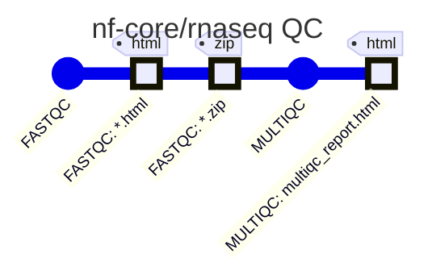
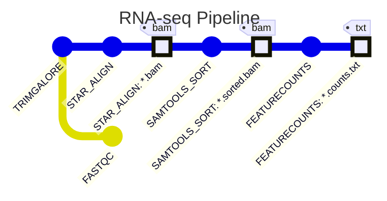
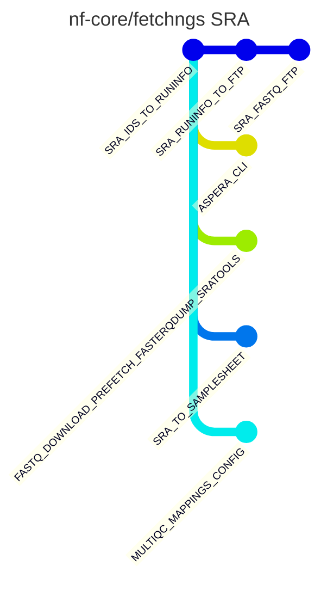

# nf-mapper

[](https://github.com/Skitionek/nf-mapper/actions/workflows/ci.yml)
[](LICENSE)
[](https://www.python.org/)

**Convert Nextflow pipelines into [Mermaid](https://mermaid.js.org/) `gitGraph` diagrams.**

nf-mapper parses `.nf` files using the
[python-groovy-parser](https://github.com/inab/python-groovy-parser) and
renders the pipeline's process graph as a metro-map-style `gitGraph`:
each process is a commit, the primary processing chain stays on `main`,
and parallel or QC branches diverge just like in a real git history.

---

## Features

- Parses real-world nf-core pipelines (tested against
  [nf-core/fetchngs](https://github.com/nf-core/fetchngs) and
  [nf-core/rnaseq](https://github.com/nf-core/rnaseq) modules)
- Extracts **processes**, **workflows**, **includes** and infers
  **process connections** from `.out` channel references
- Parses **`input:`/`output:`** sections to extract `path(...)` channel
  patterns (e.g. `"*.bam"`, `"*.html"`)
- Outputs valid [Mermaid `gitGraph`](https://mermaid.js.org/syntax/gitgraph.html)
  diagrams – paste directly into GitHub Markdown, Notion, Confluence, etc.
- **Channel nodes**: each output path pattern rendered as a `HIGHLIGHT` commit
  tagged with the file extension (e.g. `tag: "bam"`)
- **Cherry-pick**: when a branch process consumes a channel committed on a
  different branch, a `cherry-pick` commit shows the data flow explicitly
- **Workflow-call branches**: independent workflow calls in a flat pipeline are
  each placed on their own branch instead of a linear sequence
- Fixed **branch-merge logic**: branches no longer duplicate fast-forwarded
  nodes; multiple branches off the same node are all handled correctly
- Available as a **Python package**, a **CLI tool** and a **GitHub Action**

---

## Installation

```bash
pip install nf-mapper
```

Or install the latest development version:

```bash
pip install git+https://github.com/Skitionek/nf-mapper.git
```

**Requirements:** Python ≥ 3.10

---

## Quick start

### Command line

```bash
# Print diagram to stdout
nf-mapper workflow.nf

# Add a title and wrap in a Markdown fenced block
nf-mapper workflow.nf --title "My Pipeline" --format md

# Save to a file
nf-mapper workflow.nf -o diagram.md --format md

# Override Mermaid gitGraph config options
nf-mapper workflow.nf --config '{"showBranches": true}'

# Update a specific diagram block inside an existing Markdown file in-place
nf-mapper workflow.nf --update README.md --format md

# Update one of several named blocks in the same file
nf-mapper workflow.nf --update README.md --marker my-pipeline --format md
```

### Python API

```python
from nf_mapper import parse_nextflow_file, pipeline_to_mermaid

pipeline = parse_nextflow_file("workflow.nf")
diagram  = pipeline_to_mermaid(pipeline, title="My Pipeline")
print(diagram)

# Override any Mermaid gitGraph config option
diagram = pipeline_to_mermaid(pipeline, config={"showBranches": True})
```

---

## Example outputs

> These diagrams are kept up to date automatically on every push to `main`
> by [`.github/workflows/update-readme.yml`](.github/workflows/update-readme.yml).
> Each block is wrapped in named HTML comment markers so `nf-mapper --update`
> can regenerate them in-place.

### Linear pipeline  *(two-step QC)*

```nextflow
process FASTQC  { ... }
process MULTIQC { ... }

workflow {
    FASTQC(reads_ch)
    MULTIQC(FASTQC.out.zip.collect())
}
```

<!-- nf-mapper:example-linear pipeline="tests/fixtures/simple_workflow.nf" title="nf-core/rnaseq QC" format="md" -->

<!-- /nf-mapper:example-linear -->

### Branching pipeline  *(QC + alignment)*

```nextflow
include { FASTQC     } from './modules/fastqc'
include { TRIMGALORE } from './modules/trimgalore'

process STAR_ALIGN    { ... }
process SAMTOOLS_SORT { ... }
process FEATURECOUNTS { ... }

workflow RNASEQ {
    take: reads
    main:
        FASTQC(reads)
        TRIMGALORE(reads)
        STAR_ALIGN(TRIMGALORE.out.trimmed)
        SAMTOOLS_SORT(STAR_ALIGN.out.bam)
        FEATURECOUNTS(SAMTOOLS_SORT.out.sorted_bam)
}
```

<!-- nf-mapper:example-branching pipeline="tests/fixtures/complex_workflow.nf" title="RNA-seq Pipeline" format="md" -->

<!-- /nf-mapper:example-branching -->

### Real-world example – [nf-core/fetchngs](https://github.com/nf-core/fetchngs)

```bash
nf-mapper workflows/sra/main.nf --title "nf-core/fetchngs SRA"
```

<!-- nf-mapper:example-fetchngs pipeline="tests/fixtures/nf_core_fetchngs_sra.nf" title="nf-core/fetchngs SRA" format="md" -->

<!-- /nf-mapper:example-fetchngs -->

---

## CLI reference

```
usage: nf-mapper [-h] [-o FILE | --update FILE | --regenerate FILE]
                 [--marker NAME] [--title TITLE] [--format {plain,md}]
                 [--config JSON]
                 [PIPELINE.NF]

positional arguments:
  PIPELINE.NF           Path to the Nextflow pipeline file to parse.
                        Not required when --regenerate is used.

options:
  -h, --help            show this help message and exit
  -o FILE, --output FILE
                        Write the diagram to FILE instead of stdout.
  --update FILE         Update the diagram inside <!-- MARKER --> /
                        <!-- /MARKER --> comment blocks in FILE. Use
                        --marker to target a specific block when a file
                        contains multiple diagrams.
  --regenerate FILE     Scan FILE for all nf-mapper comment blocks that
                        carry a 'pipeline' preset attribute and regenerate
                        each one in-place. PIPELINE.NF is not required.
                        Preset: <!-- nf-mapper pipeline="p.nf" title="T" format="md" -->
  --marker NAME         Marker name used with --update (default: nf-mapper).
  --title TITLE         Optional diagram title.
  --format {plain,md}   Output format: 'plain' emits raw Mermaid syntax;
                        'md' wraps it in a fenced code block (default: plain).
  --config JSON         JSON object of Mermaid gitGraph config overrides,
                        e.g. '{"showBranches": true}'. Merged with defaults:
                        showBranches=false, parallelCommits=true.
```

### Preset attributes

Each `<!-- nf-mapper -->` comment block in a Markdown file can carry preset
attributes that are read back by `--regenerate`:

| Attribute | Required | Description |
|---|---|---|
| `pipeline` | ✅ | Path to the `.nf` file (relative to the Markdown file) |
| `title` | | Diagram title |
| `format` | | `plain` or `md` (default: `md`) |
| `config` | | JSON object of Mermaid gitGraph config overrides |

Use unique marker names when a file contains multiple diagrams:

```markdown
<!-- nf-mapper:main-wf pipeline="workflows/main.nf" title="Main" format="md" -->
<!-- /nf-mapper:main-wf -->

<!-- nf-mapper:qc pipeline="workflows/qc.nf" title="QC" format="md" -->
<!-- /nf-mapper:qc -->
```

Then regenerate all at once:

```bash
nf-mapper --regenerate README.md
```
---

## Python API reference

### `parse_nextflow_file(filepath) → ParsedPipeline`

Parse a `.nf` file and return a structured `ParsedPipeline` object.

```python
from nf_mapper import parse_nextflow_file

pipeline = parse_nextflow_file("workflow.nf")

print(pipeline.processes)    # list[NfProcess]  – declared process blocks
print(pipeline.workflows)    # list[NfWorkflow] – workflow blocks
print(pipeline.includes)     # list[NfInclude]  – include statements
print(pipeline.connections)  # list[tuple[str, str]] – (src, dst) edges
```

### `parse_nextflow_content(content) → ParsedPipeline`

Same as above but accepts a string instead of a file path.

```python
from nf_mapper import parse_nextflow_content

content = open("workflow.nf").read()
pipeline = parse_nextflow_content(content)
```

### `pipeline_to_mermaid(pipeline, title=None, config=None) → str`

Convert a `ParsedPipeline` to a Mermaid `gitGraph` string.

```python
from nf_mapper import pipeline_to_mermaid

# Default config (showBranches=false, parallelCommits=true)
diagram = pipeline_to_mermaid(pipeline, title="My Workflow")

# Override any Mermaid gitGraph option
diagram = pipeline_to_mermaid(pipeline, config={"showBranches": True})

# Merge with defaults – only the keys you supply are overridden
diagram = pipeline_to_mermaid(pipeline, config={"rotateCommitLabel": False})
```

The `config` dict is merged on top of the built-in defaults
(`showBranches: false`, `parallelCommits: true`).
Any key accepted by Mermaid's
[gitGraph init options](https://mermaid.js.org/syntax/gitgraph.html#gitgraph-specific-configuration-options)
can be supplied.

### Data classes

| Class | Fields |
|---|---|
| `NfProcess` | `name`, `containers`, `condas`, `templates`, `inputs`, `outputs` |
| `NfWorkflow` | `name`, `calls` |
| `NfInclude` | `path`, `imports` |
| `ParsedPipeline` | `processes`, `workflows`, `includes`, `connections` |

---

## GitHub Action

Add nf-mapper to any workflow to automatically generate a pipeline diagram
and commit it to your repository or attach it to a pull request.

### Write to a new file

```yaml
# .github/workflows/diagram.yml
name: Generate pipeline diagram

on:
  push:
    paths:
      - "**.nf"

jobs:
  diagram:
    runs-on: ubuntu-latest
    steps:
      - uses: actions/checkout@v4

      - name: Generate Mermaid diagram
        uses: Skitionek/nf-mapper@main
        with:
          pipeline: workflows/main.nf
          output: docs/pipeline_diagram.md
          title: My Pipeline
          format: md

      - name: Commit diagram
        run: |
          git config user.name  "github-actions[bot]"
          git config user.email "github-actions[bot]@users.noreply.github.com"
          git add docs/pipeline_diagram.md
          git diff --cached --quiet || git commit -m "chore: update pipeline diagram"
          git push
```

### Update a block inside an existing Markdown file

Place one or more marker pairs in your Markdown file:

```markdown
## Pipeline diagram

<!-- main-pipeline -->
<!-- /main-pipeline -->

## QC diagram

<!-- qc-pipeline -->
<!-- /qc-pipeline -->
```

Then update each block independently:

```yaml
- name: Update main pipeline diagram
  uses: Skitionek/nf-mapper@main
  with:
    pipeline: workflows/main.nf
    update: README.md
    marker: main-pipeline
    title: Main Pipeline
    format: md

- name: Update QC diagram
  uses: Skitionek/nf-mapper@main
  with:
    pipeline: workflows/qc.nf
    update: README.md
    marker: qc-pipeline
    title: QC Pipeline
    format: md
```

### Action inputs

| Input | Required | Default | Description |
|---|---|---|---|
| `pipeline` | ✅ | — | Path to the `.nf` file |
| `output` | | `diagram.md` | Output file path (ignored when `update` is set) |
| `title` | | _(none)_ | Diagram title |
| `format` | | `md` | `plain` or `md` |
| `config` | | _(none)_ | JSON object of Mermaid gitGraph config overrides, e.g. `{"showBranches": true}` |
| `update` | | _(none)_ | Path to a Markdown file with `<!-- MARKER -->` / `<!-- /MARKER -->` blocks to update in-place |
| `marker` | | `nf-mapper` | Marker name identifying which block to update; use unique names for multiple diagrams in one file |

### Action outputs

| Output | Description |
|---|---|
| `diagram` | Path to the generated or updated diagram file |

---

## How it works

1. **Parse** – The `.nf` file is tokenised and parsed with
   [python-groovy-parser](https://github.com/inab/python-groovy-parser),
   which implements a full Groovy 3 grammar using
   [Pygments](https://pygments.org/) + [Lark](https://github.com/lark-parser/lark).

2. **Extract** – The resulting AST is traversed to find:
   - `process` declarations (with `container` / `conda` directives)
   - `input:` and `output:` sections – string-literal `path(...)` patterns
     (e.g. `"*.bam"`, `"*.html"`) are extracted as channel metadata
   - `workflow` blocks (named and entry workflows, with `take:`/`main:`/`emit:` sections)
   - `include` statements (including imported process names)
   - **Process connections** inferred from `.out` channel references inside
     workflow bodies (e.g. `SORT(ALIGN.out.bam)` → edge `ALIGN → SORT`)

3. **Render** – The connection graph is laid out as a `gitGraph`:
   - The **longest path** through the DAG becomes the `main` branch
   - Parallel paths (e.g. QC steps) become named branches; multiple off-nodes
     from the same main-path node each get their own branch
   - Convergence points become `merge` commits (duplicate-free, bug-fixed)
   - Each process's output `path(...)` patterns become `type: HIGHLIGHT`
     commits tagged with the file extension
   - When a branch process uses a channel committed on a different branch,
     a `cherry-pick` commit makes the data-flow direction explicit
   - In flat mode (no channel connections), each independent workflow call
     is placed on its own branch

---

## Development

### Setup

```bash
git clone https://github.com/Skitionek/nf-mapper.git
cd nf-mapper
pip install -e ".[dev]"
```

### Running tests

```bash
pytest
```

Tests use real nf-core pipeline files as fixtures:

| Fixture | Source |
|---|---|
| `tests/fixtures/nf_core_fetchngs_sra.nf` | [nf-core/fetchngs](https://github.com/nf-core/fetchngs) `workflows/sra/main.nf` |
| `tests/fixtures/nf_core_fastqc_module.nf` | [nf-core/modules](https://github.com/nf-core/modules) `modules/nf-core/fastqc/main.nf` |

### Linting

```bash
ruff check nf_mapper/ tests/
```

### CI

GitHub Actions runs linting and the full test matrix (Python 3.10 / 3.11 / 3.12)
on every push and pull request.  See [`.github/workflows/ci.yml`](.github/workflows/ci.yml).

---

## License

nf-mapper is released under the **[MIT License](LICENSE)**.

### Third-party licences

| Dependency | Licence |
|---|---|
| [groovy-parser](https://github.com/inab/python-groovy-parser) | Apache-2.0 |
| [Lark](https://github.com/lark-parser/lark) | MIT |
| [nf-core/fetchngs](https://github.com/nf-core/fetchngs) *(test fixture)* | MIT |
| [nf-core/modules](https://github.com/nf-core/modules) *(test fixture)* | MIT |
