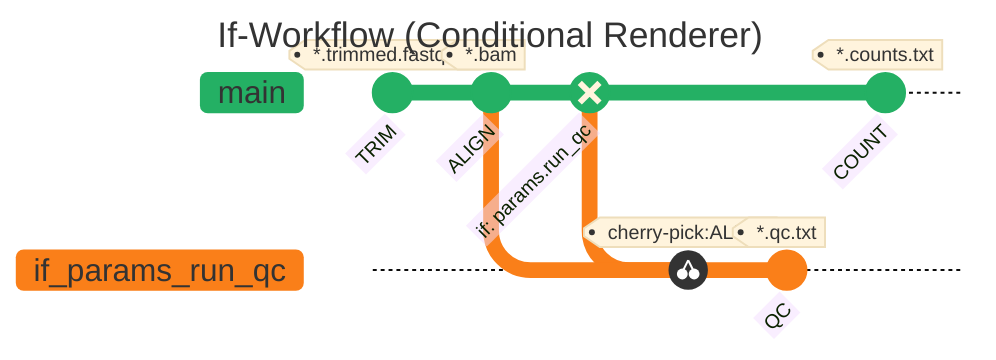

# if_workflow_conditional

> Generated from `nf-mapper/src/test/resources/fixtures/if_workflow.nf (renderer=conditional)`

```mermaid
---
title: If-Workflow (Conditional Renderer)
---
%%{init: {'theme': 'base', 'themeVariables': {'git0': '#24B064', 'gitInv0': '#ffffff', 'git1': '#FA7F19', 'gitInv1': '#ffffff', 'git2': '#0570b0', 'gitInv2': '#ffffff', 'git3': '#e63946', 'gitInv3': '#ffffff', 'git4': '#9b59b6', 'gitInv4': '#ffffff', 'git5': '#f5c542', 'gitInv5': '#000000', 'git6': '#1abc9c', 'gitInv6': '#ffffff', 'git7': '#7b2d3b', 'gitInv7': '#ffffff'}, 'gitGraph': {'showBranches': true, 'parallelCommits': false}} }%%
gitGraph LR:
   checkout main
   commit id: "TRIM" tag: "*.trimmed.fastq.gz"
   commit id: "ALIGN" tag: "*.bam"
   commit id: "if: params.run_qc" type: REVERSE
   branch if_params_run_qc
   checkout if_params_run_qc
   cherry-pick id: "ALIGN"
   commit id: "QC" tag: "*.qc.txt"
   checkout main
   commit id: "COUNT" tag: "*.counts.txt"
```
