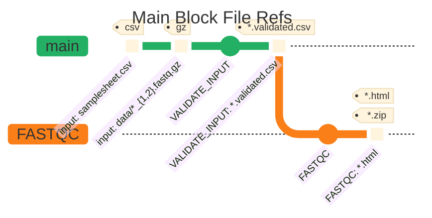

# main_file_refs

> Generated from `nf-mapper/src/test/resources/fixtures/main_file_refs.nf`

```mermaid
---
title: Main Block File Refs
---
%%{init: {'theme': 'base', 'themeVariables': {'git0': '#24B064', 'gitInv0': '#ffffff', 'git1': '#FA7F19', 'gitInv1': '#ffffff', 'git2': '#0570b0', 'gitInv2': '#ffffff', 'git3': '#e63946', 'gitInv3': '#ffffff', 'git4': '#9b59b6', 'gitInv4': '#ffffff', 'git5': '#f5c542', 'gitInv5': '#000000', 'git6': '#1abc9c', 'gitInv6': '#ffffff', 'git7': '#7b2d3b', 'gitInv7': '#ffffff'}, 'gitGraph': {'showBranches': true, 'parallelCommits': false}} }%%
gitGraph LR:
   checkout main
   commit id: "input: samplesheet.csv" type: HIGHLIGHT tag: "csv"
   commit id: "input: data/*_{1,2}.fastq.gz" type: HIGHLIGHT tag: "gz"
   commit id: "VALIDATE_INPUT"
   commit id: "VALIDATE_INPUT: *.validated.csv" type: HIGHLIGHT tag: "*.validated.csv"
   branch FASTQC
   checkout FASTQC
   commit id: "FASTQC"
   commit id: "FASTQC: *.html" type: HIGHLIGHT tag: "*.html" tag: "*.zip"
   checkout main
```
