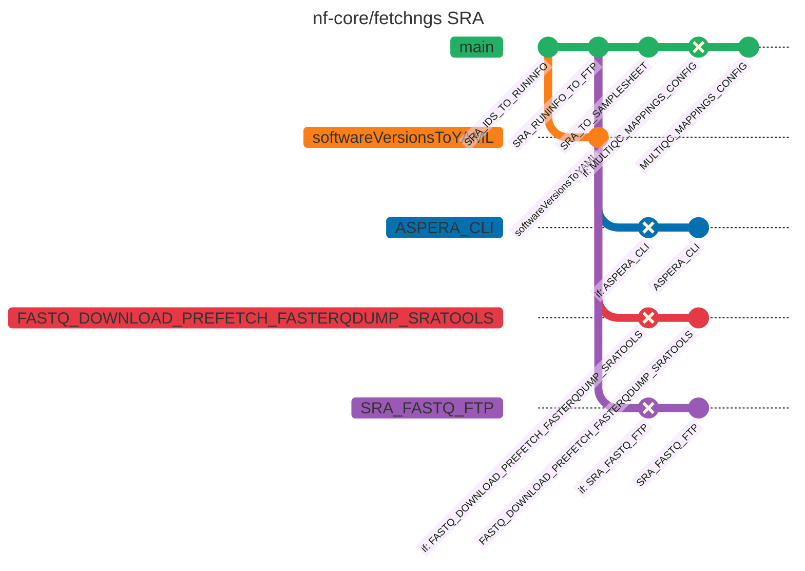

# nf_core_fetchngs_sra

> Generated from `nf-mapper/src/test/resources/fixtures/nf_core_fetchngs_sra.nf`

```mermaid
---
title: nf-core/fetchngs SRA
---
%%{init: {'theme': 'base', 'themeVariables': {'git0': '#24B064', 'gitInv0': '#ffffff', 'git1': '#FA7F19', 'gitInv1': '#ffffff', 'git2': '#0570b0', 'gitInv2': '#ffffff', 'git3': '#e63946', 'gitInv3': '#ffffff', 'git4': '#9b59b6', 'gitInv4': '#ffffff', 'git5': '#f5c542', 'gitInv5': '#000000', 'git6': '#1abc9c', 'gitInv6': '#ffffff', 'git7': '#7b2d3b', 'gitInv7': '#ffffff'}, 'gitGraph': {'showBranches': true, 'parallelCommits': true}} }%%
gitGraph LR:
   checkout main
   commit id: "SRA_IDS_TO_RUNINFO"
   branch softwareVersionsToYAML
   checkout softwareVersionsToYAML
   commit id: "softwareVersionsToYAML"
   checkout main
   commit id: "SRA_RUNINFO_TO_FTP"
   branch ASPERA_CLI
   checkout ASPERA_CLI
   commit id: "if: ASPERA_CLI" type: REVERSE
   commit id: "ASPERA_CLI"
   checkout main
   branch FASTQ_DOWNLOAD_PREFETCH_FASTERQDUMP_SRATOOLS
   checkout FASTQ_DOWNLOAD_PREFETCH_FASTERQDUMP_SRATOOLS
   commit id: "if: FASTQ_DOWNLOAD_PREFETCH_FASTERQDUMP_SRATOOLS" type: REVERSE
   commit id: "FASTQ_DOWNLOAD_PREFETCH_FASTERQDUMP_SRATOOLS"
   checkout main
   branch SRA_FASTQ_FTP
   checkout SRA_FASTQ_FTP
   commit id: "if: SRA_FASTQ_FTP" type: REVERSE
   commit id: "SRA_FASTQ_FTP"
   checkout main
   commit id: "SRA_TO_SAMPLESHEET"
   commit id: "if: MULTIQC_MAPPINGS_CONFIG" type: REVERSE
   commit id: "MULTIQC_MAPPINGS_CONFIG"
```
