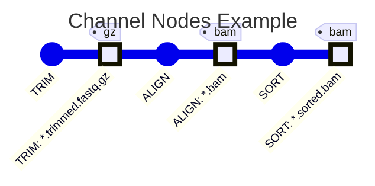

# scenario_channel_nodes

```mermaid
---
title: Channel Nodes Example
---
%%{init: {'gitGraph': {'showBranches': false, 'parallelCommits': true}} }%%
gitGraph LR:
   checkout main
   commit id: "TRIM"
   commit id: "TRIM: *.trimmed.fastq.gz" type: HIGHLIGHT tag: "gz"
   commit id: "ALIGN"
   commit id: "ALIGN: *.bam" type: HIGHLIGHT tag: "bam"
   commit id: "SORT"
   commit id: "SORT: *.sorted.bam" type: HIGHLIGHT tag: "bam"
```
