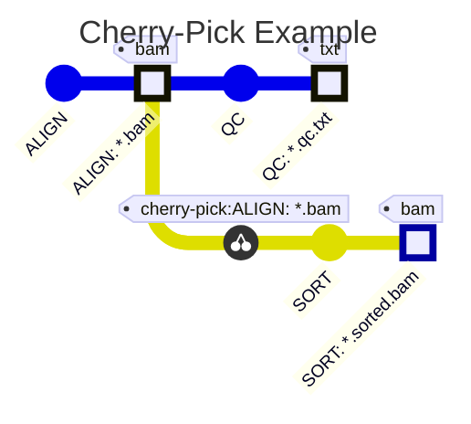

# scenario_cherry_pick

```mermaid
---
title: Cherry-Pick Example
---
%%{init: {'gitGraph': {'showBranches': false, 'parallelCommits': true}} }%%
gitGraph LR:
   checkout main
   commit id: "ALIGN"
   commit id: "ALIGN: *.bam" type: HIGHLIGHT tag: "bam"
   branch branch_1
   checkout branch_1
   cherry-pick id: "ALIGN: *.bam"
   commit id: "SORT"
   commit id: "SORT: *.sorted.bam" type: HIGHLIGHT tag: "bam"
   checkout main
   commit id: "QC"
   commit id: "QC: *.qc.txt" type: HIGHLIGHT tag: "txt"
```
