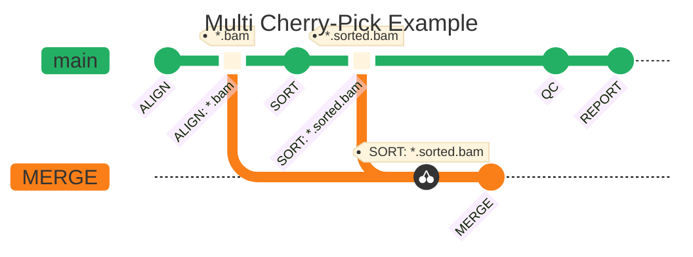

# scenario_multi_cherry_pick

```mermaid
---
title: Multi Cherry-Pick Example
---
%%{init: {'theme': 'base', 'themeVariables': {'git0': '#24B064', 'gitInv0': '#ffffff', 'git1': '#FA7F19', 'gitInv1': '#ffffff', 'git2': '#0570b0', 'gitInv2': '#ffffff', 'git3': '#e63946', 'gitInv3': '#ffffff', 'git4': '#9b59b6', 'gitInv4': '#ffffff', 'git5': '#f5c542', 'gitInv5': '#000000', 'git6': '#1abc9c', 'gitInv6': '#ffffff', 'git7': '#7b2d3b', 'gitInv7': '#ffffff'}, 'gitGraph': {'showBranches': true, 'parallelCommits': false}} }%%
gitGraph LR:
   checkout main
   commit id: "ALIGN"
   commit id: "ALIGN: *.bam" type: HIGHLIGHT tag: "*.bam"
   commit id: "SORT"
   commit id: "SORT: *.sorted.bam" type: HIGHLIGHT tag: "*.sorted.bam"
   branch MERGE
   checkout MERGE
   cherry-pick id: "ALIGN: *.bam" tag: "SORT: *.sorted.bam"
   commit id: "MERGE"
   checkout main
   commit id: "QC"
   commit id: "REPORT"
```
