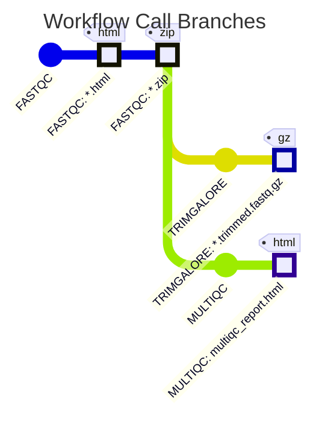

# scenario_workflow_call_branches

```mermaid
---
title: Workflow Call Branches
---
%%{init: {'gitGraph': {'showBranches': false, 'parallelCommits': true}} }%%
gitGraph LR:
   checkout main
   commit id: "FASTQC"
   commit id: "FASTQC: *.html" type: HIGHLIGHT tag: "html"
   commit id: "FASTQC: *.zip" type: HIGHLIGHT tag: "zip"
   branch branch_1
   checkout branch_1
   commit id: "TRIMGALORE"
   commit id: "TRIMGALORE: *.trimmed.fastq.gz" type: HIGHLIGHT tag: "gz"
   checkout main
   branch branch_2
   checkout branch_2
   commit id: "MULTIQC"
   commit id: "MULTIQC: multiqc_report.html" type: HIGHLIGHT tag: "html"
   checkout main
```
