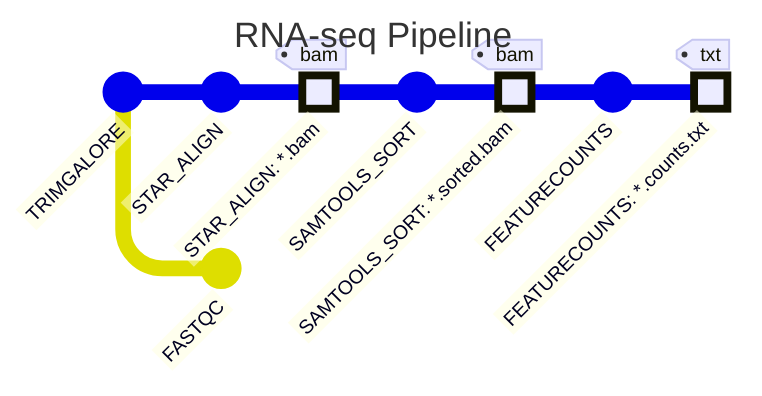

# complex_workflow

> Generated from `tests/fixtures/complex_workflow.nf`

```mermaid
---
title: RNA-seq Pipeline
---
%%{init: {'gitGraph': {'showBranches': false, 'parallelCommits': true}} }%%
gitGraph LR:
   checkout main
   commit id: "TRIMGALORE"
   branch branch_1
   checkout branch_1
   commit id: "FASTQC"
   checkout main
   commit id: "STAR_ALIGN"
   commit id: "STAR_ALIGN: *.bam" type: HIGHLIGHT tag: "bam"
   commit id: "SAMTOOLS_SORT"
   commit id: "SAMTOOLS_SORT: *.sorted.bam" type: HIGHLIGHT tag: "bam"
   commit id: "FEATURECOUNTS"
   commit id: "FEATURECOUNTS: *.counts.txt" type: HIGHLIGHT tag: "txt"
```
