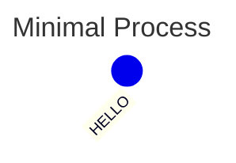

# minimal_process

> Generated from `tests/fixtures/minimal_process.nf`

```mermaid
---
title: Minimal Process
---
%%{init: {'gitGraph': {'showBranches': false, 'parallelCommits': true}} }%%
gitGraph LR:
   checkout main
   commit id: "HELLO"
```
