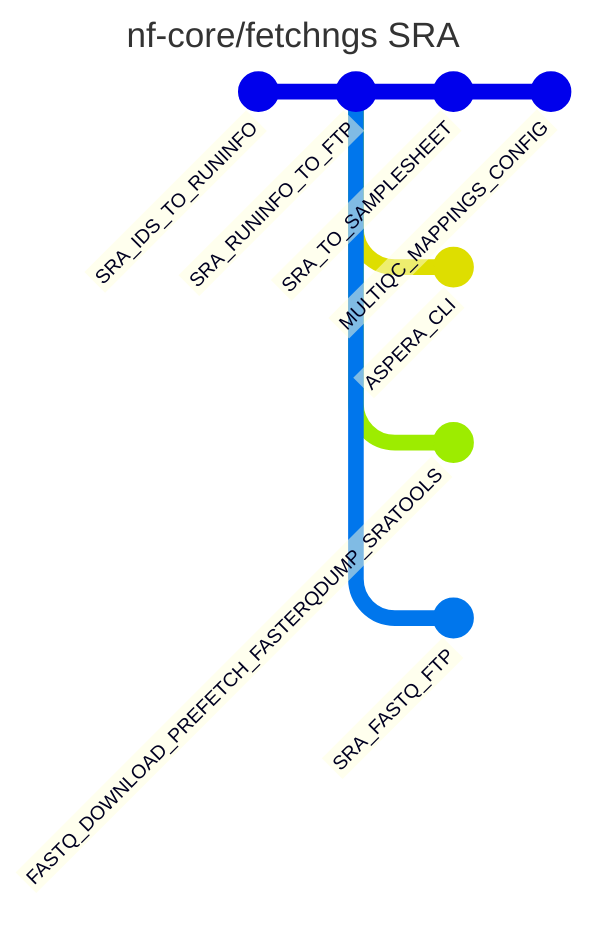

# nf_core_fetchngs_sra

> Generated from `tests/fixtures/nf_core_fetchngs_sra.nf`

```mermaid
---
title: nf-core/fetchngs SRA
---
%%{init: {'gitGraph': {'showBranches': false, 'parallelCommits': true}} }%%
gitGraph LR:
   checkout main
   commit id: "SRA_IDS_TO_RUNINFO"
   commit id: "SRA_RUNINFO_TO_FTP"
   branch branch_1
   checkout branch_1
   commit id: "ASPERA_CLI"
   checkout main
   branch branch_2
   checkout branch_2
   commit id: "FASTQ_DOWNLOAD_PREFETCH_FASTERQDUMP_SRATOOLS"
   checkout main
   branch branch_3
   checkout branch_3
   commit id: "SRA_FASTQ_FTP"
   checkout main
   commit id: "SRA_TO_SAMPLESHEET"
   commit id: "MULTIQC_MAPPINGS_CONFIG"
```
