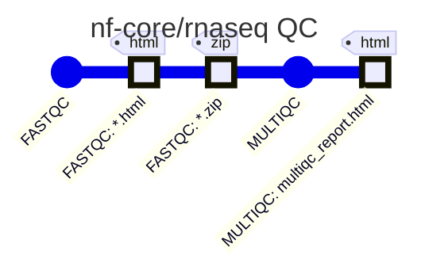

# simple_workflow

> Generated from `tests/fixtures/simple_workflow.nf`

```mermaid
---
title: nf-core/rnaseq QC
---
%%{init: {'gitGraph': {'showBranches': false, 'parallelCommits': true}} }%%
gitGraph LR:
   checkout main
   commit id: "FASTQC"
   commit id: "FASTQC: *.html" type: HIGHLIGHT tag: "html"
   commit id: "FASTQC: *.zip" type: HIGHLIGHT tag: "zip"
   commit id: "MULTIQC"
   commit id: "MULTIQC: multiqc_report.html" type: HIGHLIGHT tag: "html"
```
